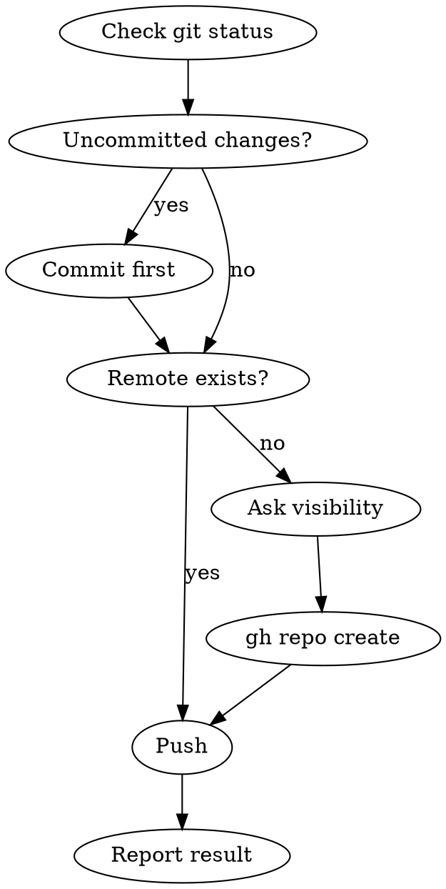

# Project Ship

Push current project to GitHub. User controls when to invoke — this skill never runs automatically.

## Workflow



### Step 1: Pre-flight Check

```bash
git status
git log --oneline -5
git remote -v
```

Verify:
- Working tree is clean. If not, ask the user whether to commit now or abort.
- At least one commit exists.

### Step 2: Remote Setup (if no remote)

Ask the user:
- **Visibility**: public or private? (default: public)
- **Repo name**: default to current directory name

Then create:

```bash
gh repo create <repo-name> --<visibility> --source=. --remote=origin
```

### Step 3: Push

```bash
git push -u origin main
```

If the default branch is not `main`, detect and use the actual branch name:

```bash
git symbolic-ref --short HEAD
```

### Step 4: Report

Output:
- Repo URL (from `gh repo view --json url -q .url`)
- Branch pushed
- Number of commits pushed

## Important

- **Never auto-trigger.** Only run when user explicitly invokes.
- **Never force-push.** If push is rejected, report the error and let the user decide.
- **Default to public.** Only create private repos when user explicitly says so.
- If `gh` is not installed, install via `brew install gh`.
- If `gh` is not authenticated, prompt user to run `! gh auth login`.
